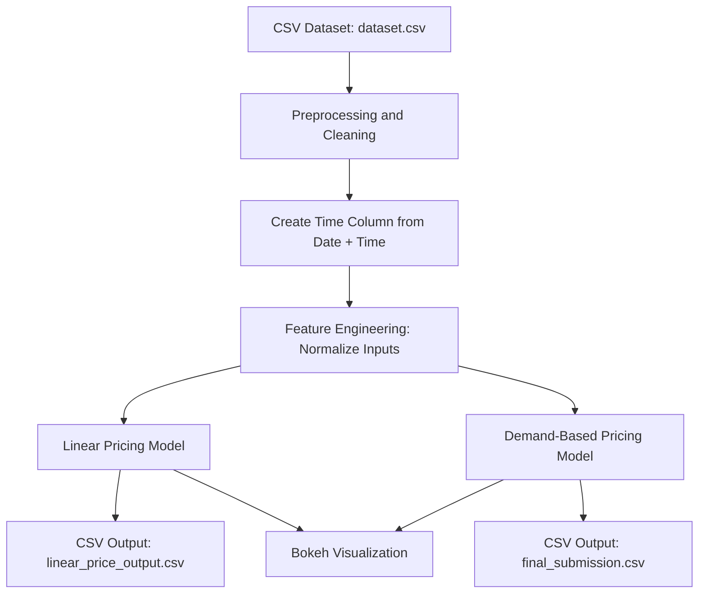

# Capstone Project: Dynamic Pricing for Urban Parking Lots

## Overview
This project implements a **real-time dynamic pricing engine** for urban parking lots using real-world parameters. It simulates a streaming scenario and adjusts parking prices based on occupancy, congestion, queue length, and special days. The system compares two pricing strategies — linear and demand-based — and visualizes real-time pricing for each lot.

## Tech Stack
- **Language:** Python
- **Notebook Environment:** Google Colab
- **Data Handling:** pandas, numpy
- **Time Parsing:** datetime
- **Streaming Simulation:** Iterative row-wise updates (mock streaming)
- **Visualization:** Bokeh
- **Export:** CSV output of final pricing streams

## Project Architecture

## Pricing Models Used
### 🔹 Linear Pricing Model
- Formula: `Price = BasePrice + α × (Occupancy / Capacity)`
- Simpler model based only on current load

### 🔹 Demand-Based Model
- Formula: `Price = BasePrice × (1 + λ × Normalized Demand)`
- Demand Score = function(occupancy, queue, traffic, special_day)
- More realistic with traffic and queue influence

## Outputs
- 📄 `final_submission.csv` → Demand-based pricing output
- 📄 `linear_price_output.csv` → Linear pricing for comparison
- 📊 Bokeh dashboard for interactive plot (1 per lot)

## Notes
- Dataset originally had `LastUpdatedDate` and `LastUpdatedTime`; combined to form a valid timestamp
- Columns were renamed for cleaner processing (`Occupancy` → `occupancy`, etc.)
- All numeric columns were converted to ensure clean arithmetic

## Optional Enhancements
- Competitive pricing based on neighboring lots
- Exporting Bokeh visuals as PNG for static sharing

---

For detailed results and graphs, refer to the notebook and visual outputs.
